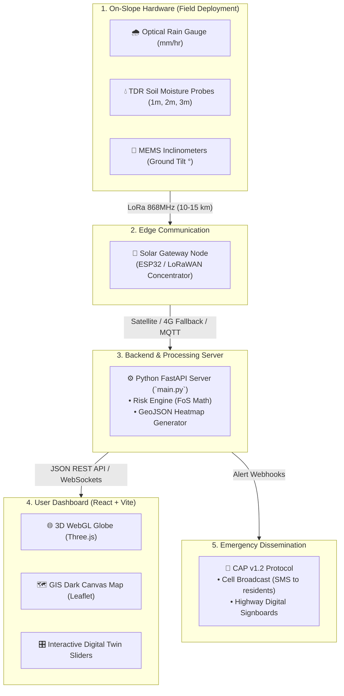

# 🏔️ Slope Sentinel / TerraShift — Complete Project Explanation & Study Guide
> **Written for 1st-Year Engineering Students, Hackathon Participants (SIH), and Viva Preparation.**  
> *Everything explained from absolute basics with real-world analogies, physics formulas, technology breakdowns, and presentation cheat sheets.*

---

## 📑 Table of Contents
1. [The Real-World Problem (Why Does This Project Exist?)](#1-the-real-world-problem)
2. [What Is Our Solution?](#2-what-is-our-solution)
3. [The Physics & Geotechnical Logic (The Math Behind It)](#3-the-physics--geotechnical-logic)
4. [End-to-End System Architecture (How Data Moves)](#4-end-to-end-system-architecture)
5. [Hardware & IoT Sensor Layer (On the Mountain)](#5-hardware--iot-sensor-layer)
6. [Technology Stack Explained (Every Tech from Scratch)](#6-technology-stack-explained)
7. [Frontend Codebase Structure & Component Flow](#7-frontend-codebase-structure--component-flow)
8. [Backend API & Risk Engine (`main.py`)](#8-backend-api--risk-engine)
9. [Smart India Hackathon (SIH) & Viva Q&A Cheat Sheet](#9-smart-india-hackathon-sih--viva-qa-cheat-sheet)

---

## 1. The Real-World Problem

### 🚜 What happens during a Landslide?
Imagine building a sandcastle on a slanted table:
* If the sand is slightly damp, the particles stick together and it stays firm.
* But if you dump a bucket of water on it, water fills the pores between sand grains, turns it into slippery liquid sludge, and the entire structure collapses down the table.

In mountainous regions (like the Himalayas, Western Ghats, Sikkim, and Nagaland along highways like **NH-29** or **NH-10**):
1. Roads are carved into steep rock and soil faces.
2. During monsoons, torrential rainfall seeps deep into the soil.
3. The water adds massive extra weight while destroying the soil's internal grip.
4. Suddenly, thousands of tons of rock and mud tear away, burying highways, destroying supply lines, and costing human lives.

### ⚠️ The Current Flaw (Why Traditional Methods Fail)
* Most government agencies are **reactive**: they wait for the hill to collapse, then send bulldozers and ambulances.
* Weather forecasts (e.g., "Heavy rain in district X") are too broad and cannot tell **which specific slope** is about to fail.

---

## 2. What Is Our Solution?

**Slope Sentinel / TerraShift** is an **IoT + AI + Physics-Powered Early Warning System (EWS)** and **Digital Twin Dashboard**.

* **Continuous Ground Monitoring:** Sensors planted directly on high-risk slopes detect rain, soil moisture, and ground tilt.
* **Physics-Guided Risk Engine:** Computes the slope's stability in real-time using geotechnical equations.
* **Real-Time Interactive Dashboard:** Provides emergency operators (DEOC / NDMA) with 3D terrain maps, risk heatmaps, and simulation tools.
* **Automated Early Warnings:** Automatically generates evacuation and highway roadblock alerts (via Common Alerting Protocol - CAP) hours before failure occurs.

---

## 3. The Physics & Geotechnical Logic

Judges love when you can explain the core engineering principles rather than just saying "we used an algorithm".

```
                [ GRAVITY (W · sin θ) ] 
                 Pulls soil DOWN the slope
                         ↓
                █████████████
               /    SOIL    /
              /    SLOPE   /   ← [ FRICTION & COHESION (c + σ' tan φ) ]
             /            /      Holds soil UP against the rock
            /            /
```

### A. The Tug-of-War: Factor of Safety (FoS)
Every hill is in a perpetual tug-of-war between two forces:
1. **Driving Forces ($\tau$):** Gravity pulling the mass of the soil downward along the slope angle.
2. **Resisting Forces ($s$):** Internal friction between soil grains and root cohesion holding the slope together.

Geotechnical engineers express this ratio as the **Factor of Safety (FoS)**:

$$\text{Factor of Safety (FoS)} = \frac{\text{Total Resisting Forces (Strength)}}{\text{Total Driving Forces (Shear Stress)}}$$

| FoS Value | State | Meaning |
| :--- | :--- | :--- |
| **FoS > 1.5** | **Safe / Stable** | Resisting strength is 50%+ greater than gravitational pull. |
| **1.0 < FoS < 1.3** | **Marginal / Warning** | Slope is under heavy stress; any sudden rain will trigger failure. |
| **FoS < 1.0** | **FAILURE / COLLAPSE** | Driving forces have overcome friction. Landslide is occurring. |

---

### B. The Triggers: Why Water Causes Failure
Water attacks a slope in two deadly ways:
1. **Added Weight (Driving Force Increases):** Dry soil weighs around $16\text{ kN/m}^3$, but saturated soil weighs up to $20\text{ kN/m}^3$.
2. **Pore Water Pressure (Resisting Force Vanishes):** According to Terzaghi's Principle:
   $$\sigma' = \sigma - u$$
   Where $\sigma'$ is effective stress (inter-particle grip), $\sigma$ is total weight, and $u$ is **pore water pressure**. As water pressure rises, it pushes soil grains apart, reducing friction to near zero.

---

### C. Our Mathematical Implementation in Code
In `backend/main.py` and `src/components/Simulation/Simulation.jsx`, we calculate the risk dynamically:

```javascript
// 1. Normalize inputs to 0.0 - 1.0 range
const r_norm = Math.min(rainfall / 200.0, 1.0);       // Max 200 mm/hr
const s_norm = Math.min(soilMoisture / 100.0, 1.0);   // Max 100% saturation

// 2. Factor of Safety Formula
const base_strength = 2.5;                            // Natural soil cohesion
const gravity_load = 1.0;                             // Nominal slope load
const water_pressure = (r_norm * 1.2) + (s_norm * 0.8);

const FoS = base_strength / (gravity_load + water_pressure);

// 3. Dynamic Risk Score (0 to 100%)
// Uses non-linear power exponents (1.3 & 1.2) because soil saturation accelerates exponentially
const riskScore = (Math.pow(r_norm, 1.3) * 60) + (Math.pow(s_norm, 1.2) * 40);
```

#### Risk Bands:
* **0% – 29% (LOW):** Green status. Nominal monitoring.
* **30% – 59% (MODERATE):** Yellow status. Sensor polling accelerated to 30s.
* **60% – 84% (HIGH):** Orange status. Pre-alert sent to highway patrol and local officials.
* **85% – 100% (CRITICAL):** Red emergency. FoS < 1.0. Sirens triggered, automated CAP SMS sent.

---

## 4. End-to-End System Architecture



---

## 5. Hardware & IoT Sensor Layer

| Sensor Name | What it Measures | Why It Matters |
| :--- | :--- | :--- |
| **Optical Rain Gauge** | Rainfall rate ($mm/hr$) | Detects cloudbursts and sudden intense rain before soil absorbs it. |
| **TDR Moisture Probe** | Volumetric Water Content (%) | Placed at multiple depths to detect how deep rainwater has seeped. |
| **MEMS Inclinometer** | Ground Tilt Angle ($\pm 0.01^\circ$) | Detects sub-millimeter creeping movements in the hill before a full slide. |
| **Piezometer** | Pore Water Pressure ($kPa$) | Directly measures the underground water pressure pushing soil grains apart. |

### Why LoRaWAN? (Why not Wi-Fi or 4G?)
* **Range:** LoRa radio signals travel **10 to 15 kilometers** across rugged mountains.
* **Ultra-Low Power:** Uses minimal battery power; a node can run for **3 to 5 years** on a tiny solar panel and rechargeable cell.
* **Resilience:** During heavy monsoons, cellular towers lose power and fiber cables snap. LoRa operates independently on unlicensed sub-GHz radio bands (865–867 MHz in India).

---

## 6. Technology Stack Explained

| Technology | What it is | Role in this Project |
| :--- | :--- | :--- |
| **React (v18)** | JavaScript UI Library | Organizes the web page into modular, reusable components (like Lego bricks). |
| **Vite** | Modern Frontend Engine | Builds and serves the web application instantly with Hot-Module-Replacement. |
| **Three.js** | 3D Graphics WebGL Library | Renders the interactive 3D Earth Globe with continents, clouds, and stars directly using the computer's GPU. |
| **Leaflet & Esri Canvas** | Interactive 2D Map Engine | Lightweight mapping library displaying the dark mountain corridor with live heatmap risk points. Free, no API keys needed. |
| **Vanilla CSS & Tokens** | Styling System | Custom CSS variables (`--bg-primary`, `--accent-green`) enabling an earthy, minimalist, dark-green engineering theme. |
| **Framer Motion** | React Animation Engine | Powers smooth scroll-reveal animations, telemetry gauges, and radar pulses. |
| **FastAPI & Python** | High-Performance Backend | Handles HTTP requests, runs the geotechnical formulas, and produces GeoJSON data. |
| **GeoJSON** | Geographic Data Format | Open standard JSON structure that encodes GPS points, bounding boxes, and heat zones. |

---

## 7. Frontend Codebase Structure & Component Flow

```
PROTOTYPE/
├── index.html                     # Main HTML shell (Google Fonts, root div)
├── package.json                   # Dependencies (React, Three, Leaflet, Framer)
├── src/
│   ├── main.jsx                   # React mounting point (renders <App /> into #root)
│   ├── App.jsx                    # Parent layout orchestrating all sections
│   ├── index.css                  # Global design tokens, resets, background colors
│   └── components/
│       ├── Navbar/                # Top navigation header & live status indicator
│       ├── Hero/                  # Hero banner with live telemetry summary widget
│       ├── Innovation/            # Problem vs Solution comparison
│       ├── Pipeline/              # 6-stage data flow architecture grid
│       ├── Simulation/            # CORE: Digital twin dashboard
│       │   ├── Simulation.jsx     # Master simulation state & risk logic
│       │   ├── Simulation.css     # 3-column layout styling
│       │   ├── ControlPanel.jsx   # Sliders for Rainfall & Soil Moisture
│       │   ├── RiskGauge.jsx      # Animated SVG risk needle & band badge
│       │   ├── SystemLog.jsx      # Terminal-style audit log
│       │   ├── Globe3D.jsx        # Three.js 3D Earth visualization
│       │   └── GISMap.jsx         # Leaflet 2D terrain map with danger zones
│       ├── TechStack/             # Full hardware & software specs
│       ├── Impact/                # Lives saved, cost reduction, deployment stats
│       └── Footer/                # Emergency contact numbers & copyright
└── backend/
    ├── main.py                    # FastAPI server & risk calculation engine
    └── requirements.txt           # Python dependencies (fastapi, uvicorn)
```

### How Reactivity Works (State Flow):
```
User drags Slider (Rainfall / Moisture)
          │
          ▼
`onChange` calls `setRainfall(newValue)` in `Simulation.jsx`
          │
          ▼
React re-runs `computeRisk(rainfall, soilMoisture)`
          │
          ├───► 1. `RiskGauge` needle rotates dynamically
          ├───► 2. Risk Band changes: LOW ➔ MODERATE ➔ HIGH ➔ CRITICAL
          ├───► 3. `SystemLog` appends new audit entry: "[12:04] FoS < 1.0! Triggering SMS"
          └───► 4. `GISMap` redraws points with wider, brighter red glowing radii
```

---

## 8. Backend API & Risk Engine (`main.py`)

If you run the Python backend (`python backend/main.py`), it exposes three REST endpoints:

1. **`GET /api/health`**
   * Verifies that the server and physics engine are running.
2. **`GET /api/telemetry`**
   * Returns simulated real-time data from an actual sensor station (Station `NH-10 Sector A`), including tilt angle, rain intensity, and confidence index.
3. **`POST /api/simulate`**
   * Accepts JSON input: `{ "rainfall": 120.0, "soilMoisture": 75.0 }`
   * Runs the Factor of Safety math and returns:
     ```json
     {
       "riskScore": 78.4,
       "riskBand": "HIGH",
       "factorOfSafety": 1.12,
       "heatmapGeoJSON": {
         "type": "FeatureCollection",
         "features": [...]
       }
     }
     ```

---

## 9. Smart India Hackathon (SIH) & Viva Q&A Cheat Sheet

Use these exact answers when judges or examiners test your knowledge:

### 🎤 30-Second Elevator Pitch:
> *"Respected judges, Slope Sentinel is an IoT-driven Early Warning System and Digital Twin for mountainous highway corridors like NH-29. Instead of waiting for disasters to occur, our system uses sub-surface ground sensors communicating over long-range LoRaWAN radio to continuously monitor soil saturation and ground tilt. Powered by geotechnical physics—specifically the Factor of Safety—our platform predicts slope collapses hours in advance and automatically triggers Common Alerting Protocol emergency warnings to protect commuters."*

---

### ❓ Top 5 Questions Judges Will Ask:

#### Q1: "Is this just an AI model or is there real physics?"
* **Your Answer:** *"It is a hybrid physics-guided system. While AI is good for pattern matching, slope failures strictly follow geotechnical laws—namely the Mohr-Coulomb failure criterion and the Factor of Safety (FoS). We balance the driving shear stress caused by gravity and rainfall weight against the resisting shear strength of the soil, which degrades as pore water pressure rises."*

#### Q2: "What happens if cellular connectivity and electricity fail during a heavy storm?"
* **Your Answer:** *"That is a key design feature of our architecture. Our ground nodes do not rely on 4G or power lines. They communicate via LoRaWAN (865–867 MHz), which transmits up to 15 km across hills using tiny solar panels and batteries. Furthermore, our edge gateways run local threshold checks on a microcontroller, allowing sirens to trigger locally even if the cloud connection is completely severed."*

#### Q3: "Why did you build a custom dashboard using React and Three.js instead of Grafana?"
* **Your Answer:** *"Grafana is built for standard server metrics, not multi-dimensional spatial disaster management. We built a custom interface to provide a multi-scale operational view: a global 3D macro-view using Three.js WebGL, micro-corridor GIS heatmaps using Leaflet, and an interactive 'what-if' simulation engine that emergency response teams can manipulate during decision-making."*

#### Q4: "What is GeoJSON and why is it used here?"
* **Your Answer:** *"GeoJSON is an open, standardized format based on JSON for representing geographical coordinates and shapes. Our backend converts risk scores into GeoJSON Point and FeatureCollection objects with latitude, longitude, radius, and risk properties. This makes our data completely interoperable with standard GIS software like QGIS, ArcGIS, and government disaster portals."*

#### Q5: "What is CAP (Common Alerting Protocol)?"
* **Your Answer:** *"CAP v1.2 is an international digital format standard developed by the ITU and OASIS, utilized in India by the NDMA (National Disaster Management Authority). When our system detects a critical risk, it compiles an alert payload with geographic boundaries, severity, and urgent instructions that can be broadcast directly to citizens' mobile phones via cell broadcasting."*

---

### 🚀 Summary Checklist for Your Team
- [x] **Problem:** Unpredictable, deadly highway landslides in monsoon season.
- [x] **Physics:** $\text{FoS} = \frac{\text{Resisting}}{\text{Driving}}$. Water creates pore pressure and kills friction.
- [x] **Network:** LoRaWAN mesh (long range, low power, independent of 4G).
- [x] **Frontend:** React + Vite + Three.js 3D Globe + Leaflet Dark GIS Map.
- [x] **Backend:** Python FastAPI calculating FoS & generating GeoJSON heatmaps.
- [x] **Alerting:** Automated CAP v1.2 broadcasts to emergency control rooms.

Viewed Globe3D.jsx:1-100
Viewed Globe3D.jsx:101-260

Here is the complete, beginner-friendly explanation of the **3D Globe** component ([`Globe3D.jsx`](file:///c:/Users/ayush/OneDrive/Desktop/LANDSLIDE%20SIH/PROTOTYPE/src/components/Simulation/Globe3D.jsx)): **what programming languages are used**, **which libraries power it**, and **how each piece of code works step-by-step**.

---

# 1. Which Languages Are Used?

The 3D Globe uses **two languages** working together:

| Language | Where it is used | What it does |
| :--- | :--- | :--- |
| **JavaScript (ES6+ / JSX)** | In the React component files | Manages the logic, component structure, state (rotation, zooming), mouse interactions, and 3D object setup. |
| **GLSL (OpenGL Shading Language)** | Inside `AtmosphereGlow()` (`vertexShader` & `fragmentShader`) | A low-level C-like language that runs directly on your computer's **Graphics Card (GPU)** to calculate photorealistic atmospheric blue haze and light scattering. |

---

# 2. Which 3D Technologies & Libraries Are Used?

If you tried to build a 3D spinning earth in pure HTML, it would be impossible. We use three industry-standard tools:

1. **Three.js (`three`):**  
   The most popular 3D engine for web browsers. It uses **WebGL** (Web Graphics Library), allowing the browser to communicate directly with your GPU to draw millions of 3D pixels at 60 frames per second.
2. **React Three Fiber (`@react-three/fiber` / R3F):**  
   Three.js normally requires long, complex lines of setup code. React Three Fiber lets us write Three.js objects as clean **React tags** (e.g. `<mesh>`, `<sphereGeometry>`, `<ambientLight>`).
3. **Drei (`@react-three/drei`):**  
   A collection of pre-made helpers for R3F, providing tools like `<OrbitControls>` (so users can rotate the Earth with their mouse) and `<Html>` (to float 2D labels in 3D space).

---

# 3. How the 3D Globe Works (Piece by Piece)

Think of building the 3D Earth like making a movie set:
* **The Stage:** The `<Canvas>` (the 3D world).
* **The Actors:** The Earth ball, the Stars, and the Nagaland Beacon pin.
* **The Lighting:** Sun/Directional lights casting shadows.
* **The Camera:** A virtual camera that you can move around.

---

### Step 1: Converting GPS (Lat/Lng) to 3D Coordinates $(X, Y, Z)$
In the real world, GPS locations are 2D coordinates: **Latitude** and **Longitude**.  
However, a 3D computer world only understands **$X$, $Y$, and $Z$ axes**.

In `Globe3D.jsx`, we use spherical trigonometry to convert GPS coordinates into a point on a sphere:

```javascript
function latLngToVector3(lat, lng, radius = 1.008) {
  // Convert degrees to radians
  const phi = (90 - lat) * (Math.PI / 180);
  const theta = (lng + 180) * (Math.PI / 180);

  // Spherical to Cartesian math:
  return new THREE.Vector3(
    -radius * Math.sin(phi) * Math.cos(theta), // X axis
    radius * Math.cos(phi),                    // Y axis
    radius * Math.sin(phi) * Math.sin(theta)  // Z axis
  );
}
```
* **Why this matters:** When we give it the coordinates of Nagaland, India (`lat: 25.682, lng: 93.75`), this function calculates the exact $(X, Y, Z)$ position on the surface of our 3D ball.

---

### Step 2: The Deep Space Starfield (`Starfield()`)
To make space feel deep and realistic, we don't use a flat picture. We generate **2,200 individual 3D star points** scattered randomly around the Earth:

```javascript
function Starfield() {
  const count = 2200;
  // Positions (x, y, z) and Colors (r, g, b) stored in high-speed typed arrays
  const pos = new Float32Array(count * 3);
  const col = new Float32Array(count * 3);
  ...
```

* **Animation loop (`useFrame`):**  
  ```javascript
  useFrame((_, delta) => {
    pointsRef.current.rotation.y += delta * 0.005; // Stars rotate slowly
  });
  ```
  Every time the screen refreshes (60 times a second), the starfield rotates slightly, giving the illusion of drifting through space.

---

### Step 3: The Earth Sphere (`EarthMesh()`)
How do we create the Earth?
Imagine taking a grey rubber ball and wrapping a world map poster around it:

```jsx
function EarthMesh() {
  // Load real NASA satellite textures
  const dayMap = useLoader(THREE.TextureLoader, EARTH_TEXTURE_URL);
  const topoMap = useLoader(THREE.TextureLoader, EARTH_TOPO_URL);

  return (
    <mesh>
      {/* 1. The 3D geometry: A sphere divided into 64 vertical and 64 horizontal slices */}
      <sphereGeometry args={[1, 64, 64]} />

      {/* 2. The Material: Defines how light bounces off the surface */}
      <meshPhongMaterial
        map={dayMap}          {/* NASA Blue Marble satellite photo */}
        bumpMap={topoMap}      {/* Elevation map that gives mountains real 3D bumps */}
        bumpScale={0.035}
        specularMap={topoMap}  {/* Makes oceans shiny while land stays matte */}
        specular="#1e4976"
        shininess={12}
      />
    </mesh>
  );
}
```

---

### Step 4: The Glowing Atmosphere (`AtmosphereGlow()`)
When astronauts look at Earth from space, they see a luminous blue rim around the edges of the planet.

To create this effect, we wrap the Earth in slightly larger invisible spheres ($1.018\times$ and $1.11\times$ the size) and run custom **GLSL Shaders**:

```glsl
// GLSL Fragment Shader running on GPU:
varying vec3 vNormal;
void main() {
  // dot product checks angle between camera and sphere edge
  float intensity = pow(0.72 - dot(vNormal, vec3(0.0, 0.0, 1.0)), 2.2);
  gl_FragColor = vec4(0.05, 0.65, 1.0, 1.0) * intensity * 0.9;
}
```
* **How it works:** If a point on the sphere faces directly toward your eye, its glow is zero. But as the surface curves away toward the edge, the glow increases exponentially, producing a natural, glowing blue atmospheric rim.

---

### Step 5: The Interactive Nagaland Radar Beacon (`BeaconMarker()`)
We place a pulsing marker on the NH-29 mountain corridor in Nagaland:

1. **The Dot:** A tiny 3D sphere placed at our calculated $(X, Y, Z)$ position.
2. **The Radar Pulse:** A flat ring (`<ringGeometry>`) whose size expands and fades continuously using `Math.sin(time)`.
3. **The Floating Tooltip:** An `<Html>` tag from Drei that renders a stylized, translucent cyber-card floating directly over the 3D mountain:
   ```jsx
   <Html position={[0.045, 0.035, 0]}>
     <div className="badge">
       NH-29 Nagaland, India ● SLOPE RISK: 85%
     </div>
   </Html>
   ```
   If the risk exceeds 75%, the marker automatically turns from **cyan/green to bright neon red**.

---

### Step 6: Mouse Controls & Inspection Zoom (`OrbitControls` & `CameraController`)
* **`<OrbitControls>`:** Lets the user click and drag to rotate the globe in any direction, or scroll to zoom in and out.
* **The "Inspect Sector" Button:** When clicked, the `CameraController` smoothly animates the camera closer to Nagaland ($X, Y, Z$), mimicking a satellite zooming from orbit straight into the mountain highway.

---

# 💡 Quick Summary to Tell Judges:

> *"Our 3D Globe is implemented in **JavaScript (React)** using **Three.js** and **React Three Fiber (WebGL)**, accelerated by custom **GLSL shaders** running directly on the user's GPU. We project NASA Blue Marble satellite imagery and elevation bump-maps onto a 3D sphere geometry, map real-world GPS coordinates from Nagaland onto 3D Cartesian vectors, and overlay dynamic radar pulse markers and a 2,200-particle starfield."*